# Architecture

Quikode is organized around a single task FSM, a fresh-schema SQLite store, profile-specific project settings, and worker/orchestrator modules that emit typed events.

## FSM

Plan 58 (2026-05-10) flattened the FSM: the umbrella states `PRE_PR_AUDITING` and `ADDRESSING_FEEDBACK` are removed; the 5-stage audit gauntlet (`AUDIT_LOCAL_CI` → `AUDIT_RUBRIC` → `AUDIT_STANDARDS` → `AUDIT_ARCHITECTURE` → `AUDIT_BEHAVIOR`) is first-class. The shared inner fixup machinery (`FIXUP_PLANNING` → `DOING_SUBTASK` → `CHECKING_SUBTASK` → `TRIAGING_SUBTASK` → `COMMITTING` → `PUSHING`) is reused across all triggers (initial audit, CI failure, review feedback); the trigger source only branches at the OUTER wrapping (PR_OPENING vs. PENDING_CI after the cycle settles). A unified `workers/audit_driver.py:_run_audit_cycle(trigger_source)` drives the cycle. Lifecycle phase + cycle (`tasks.phase`, `tasks.cycle_in_phase`, `tasks.pr_review_trigger`) live alongside state for operator-visible "where in the broader lifecycle is this task." Plan 57's typed-helper guards mean `fsm_runtime.enter_*` invocations silently skip on invalid source state instead of crashing — the FSM event table below is authoritative.

```mermaid
stateDiagram-v2
  [*] --> pending
  state pending
  state provisioning
  state planning
  state doing_subtask
  state checking_subtask
  state triaging_subtask
  state committing
  state pushing
  state local_ci_checking
  state audit_local_ci
  state audit_rubric
  state audit_standards
  state audit_architecture
  state audit_behavior
  state fixup_planning
  state pr_opening
  state pending_ci
  state awaiting_review
  state rebasing_to_main
  state conflict_resolving
  state merged
  state merge_node_ready
  state merge_node_retired
  state blocked
  state failed
  state aborted
  pending --> provisioning: start_task
  provisioning --> planning: environment_ready
  planning --> doing_subtask: plan_valid
  doing_subtask --> checking_subtask: doer_done
  checking_subtask --> committing: subtask_passed
  checking_subtask --> triaging_subtask: subtask_failed
  triaging_subtask --> doing_subtask: retry_subtask
  triaging_subtask --> blocked: retry_exhausted
  committing --> pushing: commit_created
  pushing --> doing_subtask: more_subtasks
  pushing --> local_ci_checking: all_subtasks_done
  local_ci_checking --> audit_local_ci: local_ci_passed
  local_ci_checking --> fixup_planning: local_ci_failed
  audit_local_ci --> audit_rubric: audit_local_ci_passed
  audit_local_ci --> fixup_planning: audit_local_ci_failed
  audit_rubric --> audit_standards: audit_rubric_passed
  audit_rubric --> fixup_planning: audit_rubric_failed
  audit_standards --> audit_architecture: audit_standards_passed
  audit_standards --> fixup_planning: audit_standards_failed
  audit_architecture --> audit_behavior: audit_architecture_passed
  audit_architecture --> fixup_planning: audit_architecture_failed
  audit_behavior --> pr_opening: audit_behavior_passed
  audit_behavior --> fixup_planning: audit_behavior_failed
  pending_ci --> audit_local_ci: ci_fixup_start
  awaiting_review --> audit_local_ci: ci_fixup_start
  awaiting_review --> audit_local_ci: review_fixup_start
  fixup_planning --> doing_subtask: fixup_plan_valid
  fixup_planning --> blocked: fixup_exhausted
  pr_opening --> pending_ci: pr_opened
  pending_ci --> awaiting_review: ci_passed
  awaiting_review --> merged: merged
  audit_behavior --> merge_node_ready: merge_node_built
  merge_node_ready --> pending: parent_advanced
  merge_node_ready --> merge_node_retired: all_parents_merged
  pending_ci --> rebasing_to_main: parent_merged_or_conflict
  awaiting_review --> rebasing_to_main: parent_merged_or_conflict
  rebasing_to_main --> pending_ci: rebase_pushed
  rebasing_to_main --> conflict_resolving: conflict
  conflict_resolving --> rebasing_to_main: resolved
  conflict_resolving --> blocked: unresolved
  pending --> aborted: abort
  provisioning --> failed: crash
  planning --> failed: crash
  doing_subtask --> failed: crash
  checking_subtask --> failed: crash
  triaging_subtask --> failed: crash
  committing --> failed: crash
  pushing --> failed: crash
  local_ci_checking --> failed: crash
  audit_local_ci --> failed: crash
  audit_rubric --> failed: crash
  audit_standards --> failed: crash
  audit_architecture --> failed: crash
  audit_behavior --> failed: crash
  fixup_planning --> failed: crash
  pr_opening --> failed: crash
  rebasing_to_main --> failed: crash
  conflict_resolving --> failed: crash
  blocked --> pending: retry_task
  failed --> pending: retry_task
  aborted --> pending: retry_task
  blocked --> pending: resume_task
  failed --> pending: resume_task
  pending --> merged: mark_merged
  pending_ci --> aborted: pr_closed
  awaiting_review --> aborted: pr_closed
  doing_subtask --> blocked: block_task
  checking_subtask --> blocked: block_task
  provisioning --> blocked: block_task
  triaging_subtask --> blocked: block_task
  committing --> blocked: block_task
  pr_opening --> blocked: block_task
  local_ci_checking --> blocked: block_task
  audit_rubric --> blocked: block_task
  audit_local_ci --> blocked: block_task
  planning --> blocked: block_task
  audit_architecture --> blocked: block_task
  rebasing_to_main --> blocked: block_task
  audit_behavior --> blocked: block_task
  pushing --> blocked: block_task
  fixup_planning --> blocked: block_task
  audit_standards --> blocked: block_task
  doing_subtask --> rebasing_to_main: parent_merged_or_conflict
  checking_subtask --> rebasing_to_main: parent_merged_or_conflict
  provisioning --> rebasing_to_main: parent_merged_or_conflict
  triaging_subtask --> rebasing_to_main: parent_merged_or_conflict
  committing --> rebasing_to_main: parent_merged_or_conflict
  pr_opening --> rebasing_to_main: parent_merged_or_conflict
  local_ci_checking --> rebasing_to_main: parent_merged_or_conflict
  audit_rubric --> rebasing_to_main: parent_merged_or_conflict
  conflict_resolving --> rebasing_to_main: parent_merged_or_conflict
  audit_local_ci --> rebasing_to_main: parent_merged_or_conflict
  planning --> rebasing_to_main: parent_merged_or_conflict
  audit_architecture --> rebasing_to_main: parent_merged_or_conflict
  audit_behavior --> rebasing_to_main: parent_merged_or_conflict
  pushing --> rebasing_to_main: parent_merged_or_conflict
  fixup_planning --> rebasing_to_main: parent_merged_or_conflict
  audit_standards --> rebasing_to_main: parent_merged_or_conflict
```

## Store

`quikode.state_schema` creates the current schema directly. Startup validates that existing task states are part of the FSM. Runtime transitions are event-driven through `Store.apply_event(...)`; `Store.seed_merged_node(...)` is reserved for fresh workspace seeding.

## Modules

CLI modules print and call services. Worker modules handle provision, subtask execution, local validation, PR opening, feedback, and rebase paths. Orchestrator modules handle scheduling, PR/review watching, merge watching, and supervision.

## Profiles

Profiles hold project-specific commands, resource defaults, merge policy, and prompt context. Generic code reads profile data and does not embed project assumptions.
